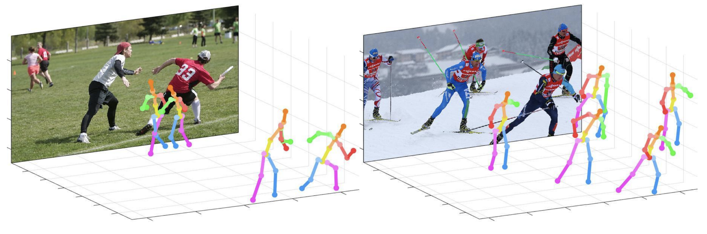

# 3D Pose Estimation and RULA Assessment

  

## Project Overview

This research project combines 3D pose estimation with Rapid Upper Limb Assessment (RULA) to evaluate ergonomic risks in various environments. By leveraging advanced computer vision techniques, we aim to automate the process of identifying potentially harmful postures and movements in real-time.

## Purpose

The primary goal of this project is to develop a system that can:

1. Accurately detect and track human poses in 3D space
2. Calculate relevant joint angles for ergonomic assessment
3. Apply RULA methodology to quantify potential risks
4. Visualize results for easy interpretation and analysis

## Research Focus

Our research explores the integration of state-of-the-art 3D pose estimation algorithms with established ergonomic assessment tools. We're investigating ways to improve accuracy, reduce computational overhead, and adapt the system for various real-world scenarios.

## Real-Life Applications

This technology has potential applications across numerous industries:

- Manufacturing: Assess and improve worker postures on assembly lines
- Healthcare: Monitor patient movements and assist in physical therapy
- Office Environments: Evaluate and enhance workplace ergonomics
- Sports and Fitness: Analyze athlete performance and prevent injuries
- Virtual Reality: Enhance user experience by ensuring comfortable interactions

By automating ergonomic assessments, we aim to contribute to safer, healthier work environments and improved quality of life across various sectors.

## Project Status

This is an ongoing research project. We continue to refine our algorithms, explore new applications, and collaborate with industry partners to validate and improve our system.
